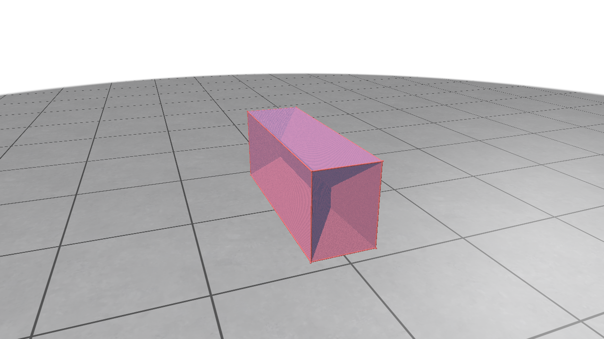

# PyAOF
[](https://pypi.org/project/pyaof/)
[](https://pypi.org/project/pyaof/)
[](LICENSE)
[](https://github.com/haaput/pyaof/actions/workflows/tests.yml)

PyAOF is a Python library for computing **Average Outward Flux (AOF)**  on 3D meshes using NVIDIA Warp.

---

## Features

- Compute **Average Outward Flux (AOF)** volumes
- Efficient tiled computation for large volumes
- Optional 3D visualization with **Polyscope** and **Matplotlib**

---

## Installation

### Basic Installation

```bash
pip install pyaof
```

### Installation with Visualization Support

If you want to run the visualization examples that render 3D meshes and point clouds (requires `matplotlib` and `polyscope`):

```bash
pip install "pyaof[viz]"
```

## Developer Installation

If you are contributing to the project or want to run the local test suite and coverage tools, install the `test` dependencies:

```bash
pip install "pyaof[test]"
```

## Install Everything

To install all optional dependencies at once:

```bash
pip install "pyaof[all]"
```
---


## Quick Start

```python
import vtk
from pyaof import compute_aof, compute_sdf

# 1. Load mesh
reader = vtk.vtkOBJReader()
reader.SetFileName("data/cuboid.obj")
reader.Update()
mesh = reader.GetOutput()

# 2. Compute Signed Distance Field (SDF)
sdf, normalized_mesh, mesh_vertices, spacing = compute_sdf(
    mesh,
    resolution=1000,
    normalize=True
)

# 3. Compute Average Outward Flux (AOF)
aof_vol = compute_aof(
    sdf,
    tile_size=1024
)
```

---

## Examples

The `examples/` directory contains full usage demonstrations, including:

- Mesh loading and preprocessing
- SDF generation
- AOF computation
- 3D visualization using Polyscope

Run an example:

```bash
python examples/demo_polyscope.py
```



---

## Requirements

- Python 3.12+
- NumPy
- VTK
- SciPy

Optional visualization dependencies:

- Matplotlib
- Polyscope

---

## License

MIT License

---

## Citation

If you use PyAOF in academic work, please cite the repository and related publications.